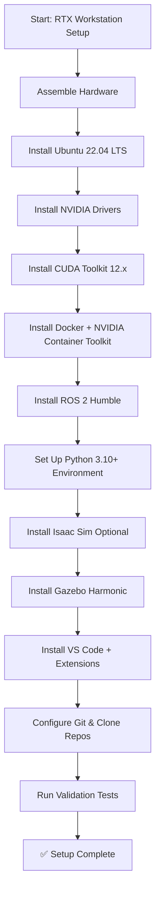
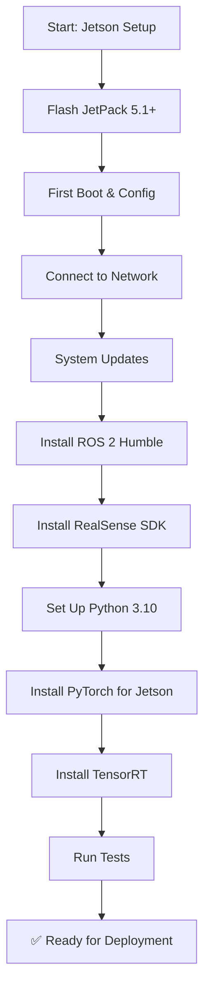
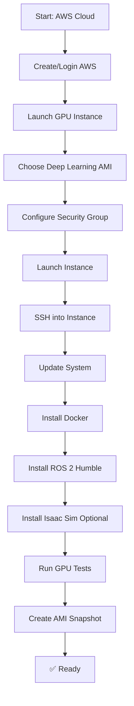

# Building Your Physical AI Lab – Hardware, Cloud, and Budget Options

This guide helps you set up a development environment for Physical AI and Humanoid Robotics, whether you're building a local workstation, using affordable edge hardware, or leveraging cloud computing.

## Quick Start Options

### Option 1: Cloud-Only (No Local Hardware)
**Cost**: ~$50-200/month
**Best for**: Students, learners exploring the field

- AWS g5/g6 instances for GPU acceleration
- ROS 2 and Isaac Sim in cloud containers
- Access via web browser or SSH
- No upfront hardware cost

### Option 2: Entry-Level Local Setup
**Cost**: ~$700-1000
**Best for**: Hobbyists, university students

- NVIDIA Jetson Orin Nano/NX Developer Kit (~$500)
- RealSense D435i camera (~$200)
- Basic robot platform or simulation-only

### Option 3: Professional Workstation
**Cost**: ~$2500-4000
**Best for**: Serious developers, researchers

- Desktop with NVIDIA RTX 3060+ GPU
- 32GB+ RAM
- RealSense D435i camera
- Optional: Unitree Go2 or similar robot platform

## Local Hardware Options

### RTX Workstation Specifications (Task T192)

A local GPU workstation provides the best experience for simulation, training, and development with zero network latency.

| Component | Minimum | Recommended | High-End |
|-----------|---------|-------------|----------|
| **GPU** | RTX 3060 (12GB VRAM) | RTX 3080 (12GB VRAM) | RTX 4090 (24GB VRAM) |
| **CPU** | Intel i5-12400 / AMD Ryzen 5 5600X | Intel i7-13700K / AMD Ryzen 7 7700X | Intel i9-13900K / AMD Ryzen 9 7950X |
| **RAM** | 32GB DDR4 | 64GB DDR4/DDR5 | 128GB DDR5 |
| **Storage** | 1TB NVMe SSD | 2TB NVMe SSD | 4TB NVMe SSD |
| **Motherboard** | B660 / B550 | Z790 / X670 | Z790 / X670E |
| **PSU** | 750W 80+ Gold | 850W 80+ Gold | 1000W 80+ Platinum |
| **Case** | Mid-tower with good airflow | Mid-tower with excellent cooling | Full-tower with premium cooling |
| **Cooling** | Stock CPU cooler | 240mm AIO or high-end air | 360mm AIO liquid cooling |
| **Estimated Cost** | **$1,500-$2,000** | **$2,500-$3,500** | **$4,000-$6,000** |

**Advantages**:
- ✅ No network latency for real-time robot control
- ✅ One-time cost with no recurring fees
- ✅ Full control over environment and configuration
- ✅ Can connect physical robots directly via USB/Ethernet
- ✅ Hardware retains resale value

**Disadvantages**:
- ❌ High upfront investment
- ❌ Requires physical space and proper cooling
- ❌ Power consumption costs (~$20-40/month at full load)
- ❌ Hardware becomes outdated over 3-5 years

### Economy Jetson Student Kit (~$700) (Task T193)

For students and hobbyists, NVIDIA Jetson provides affordable edge computing ideal for robot deployment and sim-to-real transfer validation.

#### Complete Kit Breakdown

| Item | Specification | Purpose | Cost (USD) |
|------|---------------|---------|------------|
| **NVIDIA Jetson Orin Nano 8GB** | 8GB RAM, 40 TOPS AI performance | Main compute for robot control & perception | $499 |
| **Intel RealSense D435i** | RGB-D camera with IMU, 90 FPS | Visual perception and SLAM | $300 |
| **MicroSD Card** | 128GB U3 A2 (fast read/write) | Operating system and data storage | $25 |
| **Power Supply** | 5V 4A USB-C PD | Power for Jetson | $15 |
| **Active Cooling Fan** | PWM-controlled for Orin | Thermal management during training/inference | $10 |
| **USB 3.0 Hub** | 4-port powered hub | Connect peripherals | $15 |
| **Ethernet Cable** | Cat 6, 6ft | Network connectivity | $8 |
| **HDMI Cable** | Micro-HDMI to HDMI | Display connection for initial setup | $10 |
| **Keyboard/Mouse** | Basic USB set | Initial configuration | $20 |
| **Cables & Mounting** | USB-C cables, standoffs, etc. | Assembly and connections | $30 |
| **TOTAL** | | | **~$700** |

**What You Can Do with This Kit**:
- ✅ Run ROS 2 Humble natively on Ubuntu 20.04/22.04
- ✅ Deploy trained models for real-time inference on robot
- ✅ Test perception pipelines with RealSense depth camera
- ✅ Develop and debug robot control code locally
- ✅ Sim-to-real transfer validation and fine-tuning
- ✅ Edge AI deployment for autonomous navigation

**What You Cannot Do** (requires workstation or cloud):
- ❌ Heavy simulation (Isaac Sim, Unity, Gazebo with complex scenes)
- ❌ Large-scale reinforcement learning training
- ❌ Multi-robot simulations with many agents
- ❌ High-resolution synthetic data generation
- ❌ Training vision-language-action models from scratch

**Recommended Workflow**:
1. **Develop and Train** on workstation or cloud GPU instance
2. **Deploy to Jetson** for real-world testing and edge inference
3. **Iterate** based on real-world performance metrics
4. **Fine-tune** models on Jetson for specific deployment scenarios

### Other Edge Computing Options

| Device | Cost | AI Performance | RAM | Use Case |
|--------|------|----------------|-----|----------|
| **Jetson Orin Nano 8GB** | $499 | 40 TOPS | 8GB | Student kit, prototyping |
| **Jetson Orin NX 16GB** | $799 | 100 TOPS | 16GB | Development, edge deployment |
| **Jetson AGX Orin 32GB** | $1,999 | 275 TOPS | 32GB | Production robotics, multi-sensor fusion |

### Sensors & Cameras

| Sensor | Cost | Specifications |
|--------|------|----------------|
| RealSense D435i | $200 | RGB-D, IMU, 90 FPS |
| RealSense L515 | $350 | LiDAR, high precision |
| ZED 2i | $450 | Stereo, IMU, AI processing |

### Robot Platform Comparison (Task T230)

Complete comparison of educational and research robot platforms for Physical AI development.

| Platform | Type | Cost (USD) | DOF | Payload | Capabilities | ROS 2 Support | Use Case |
|----------|------|------------|-----|---------|--------------|---------------|----------|
| **TurtleBot 4** | Mobile Base | $1,500 | N/A | 14kg | Differential drive, sensors | Native | Education, navigation, SLAM |
| **TurtleBot 4 Lite** | Mobile Base | $1,000 | N/A | 9kg | Budget version of TB4 | Native | Entry-level navigation |
| **Clearpath Jackal** | Mobile Base | $18,000 | N/A | 20kg | Outdoor, ruggedized | Native | Field robotics, research |
| **Unitree Go2** | Quadruped | $2,700 | 12 | 5kg | Walking, obstacle traverse | Community packages | Legged locomotion research |
| **Unitree A1** | Quadruped | $10,000 | 12 | 5kg | Advanced quadruped | Community packages | Dynamic locomotion |
| **Boston Dynamics Spot** | Quadruped | $75,000+ | 12 | 14kg | Professional-grade | Official SDK | Industrial inspection |
| **Unitree G1** | Humanoid | $16,000 | 23-43 | 2kg arms | Whole-body control | In development | Humanoid research |
| **ROBOTIS OP3** | Humanoid | $10,000 | 20 | 500g | Open hardware/software | Native | Education, soccer |
| **TIAGo** | Mobile Manipulator | $100,000+ | 7-15 | 3kg | Service robot | Native | Manipulation research |
| **Fetch Mobile Manipulator** | Mobile Manipulator | $100,000+ | 7+2 | 6kg | Warehouse automation | Native | Research, logistics |

**Key Considerations When Choosing**:
- **Budget**: TurtleBot 4 or Unitree Go2 for affordability
- **Research Focus**: Quadruped (Go2), Humanoid (G1, OP3), Mobile Manipulation (TIAGo)
- **ROS 2 Native Support**: Critical for textbook examples (TurtleBot 4, OP3)
- **Community**: Larger communities = more examples, troubleshooting help
- **Safety**: Start with simulation, graduate to real hardware

**Recommended Learning Path**:
1. **Simulation Only** (Months 1-3): Gazebo, Isaac Sim - $0
2. **Jetson Dev Kit** (Months 4-6): Edge deployment practice - $700
3. **TurtleBot 4 or Go2** (Months 7+): Real robot experimentation - $1,500-$2,700
4. **Advanced Platforms** (Year 2+): Humanoids, mobile manipulators - $10,000+

## Software Requirements

### Free & Open Source
- **ROS 2 Humble LTS** - Robot middleware
- **Gazebo Harmonic** - Physics simulation
- **Python 3.10+** - Programming environment
- **VS Code** - Development IDE

### Commercial (Free for Education)
- **NVIDIA Isaac Sim** - AI-powered simulation
- **Unity 2022.x LTS** - High-fidelity rendering
- **GitHub Copilot** - AI code assistant

## Cloud Computing Alternatives (Task T194)

If local hardware isn't feasible, cloud GPU instances offer flexible pay-as-you-go options with access to latest hardware.

### AWS GPU Instance Pricing (as of 2024)

| Instance Type | GPU | vCPUs | RAM | GPU Memory | On-Demand $/hour | Monthly Cost (730 hrs) | Best For |
|---------------|-----|-------|-----|------------|------------------|------------------------|----------|
| **g5.xlarge** | NVIDIA A10G (1x) | 4 | 16GB | 24GB | $1.006 | **$734** | Light simulation, code development |
| **g5.2xlarge** | NVIDIA A10G (1x) | 8 | 32GB | 24GB | $1.212 | **$885** | Full simulation, small-scale RL training |
| **g5.4xlarge** | NVIDIA A10G (1x) | 16 | 64GB | 24GB | $1.624 | **$1,186** | Heavy simulation, medium-scale training |
| **g6.xlarge** | NVIDIA L4 (1x) | 4 | 16GB | 24GB | $0.840 | **$613** | Cost-effective development, inference |
| **g6.2xlarge** | NVIDIA L4 (1x) | 8 | 32GB | 24GB | $1.010 | **$737** | Balanced performance/cost |

**Spot Instance Savings**: 50-70% discount with interruption risk (ideal for long training runs)
**Reserved Instances**: 30-50% discount with 1-3 year commitment (for production workloads)

### Cloud Cost Optimization Strategies

#### 1. Part-Time Student Usage (~10 hours/week, 40 hours/month)
- **g5.xlarge**: $1.006 × 40 hrs/month = **$40/month**
- **g6.xlarge**: $0.840 × 40 hrs/month = **$34/month**
- **Total annual cost**: ~$408-$480
- **Best for**: Weekend projects, occasional learning

#### 2. Full-Time Student/Researcher (~40 hours/week, 160 hours/month)
- **g5.2xlarge**: $1.212 × 160 hrs/month = **$194/month**
- **g5.2xlarge (Spot)**: ~$97/month (50% savings)
- **Total annual cost**: ~$1,164-$2,328
- **Best for**: Thesis work, serious projects

#### 3. Continuous Development (~730 hours/month, 24/7)
- **g5.xlarge**: $1.006 × 730 hrs/month = **$734/month** = **$8,808/year**
- **g6.xlarge**: $0.840 × 730 hrs/month = **$613/month** = **$7,356/year**
- **Comparison**: RTX 3080 workstation ($2,800) breaks even in **4 months** vs. continuous cloud
- **Verdict**: Local hardware more cost-effective for full-time use

#### 4. Hybrid Approach (Jetson + Cloud 10 hrs/week)
- **Jetson Orin Nano Kit**: $700 one-time
- **Cloud g6.xlarge**: $34/month × 12 months = **$408/year**
- **Year 1 total cost**: **$1,108**
- **Year 2+ cost**: **$408/year** (no hardware re-purchase)
- **Best for**: Students wanting real robot deployment + occasional heavy training

### Cloud Advantages & Disadvantages

**Advantages**:
- ✅ Zero upfront hardware investment
- ✅ Scale up/down based on project needs
- ✅ Access to latest NVIDIA GPUs (A10G, L4, H100)
- ✅ No maintenance, cooling, or electricity costs
- ✅ Global accessibility (work from anywhere)

**Disadvantages**:
- ❌ Recurring monthly costs add up quickly
- ❌ Network latency for robot control (see critical warning below)
- ❌ Data transfer fees for large datasets
- ❌ Requires reliable high-speed internet (50+ Mbps recommended)
- ❌ No hardware ownership or resale value

---

## ⚠️ Cloud Control Latency Warning (Task T195)

:::danger CRITICAL: Network Latency for Physical Robot Control
**Controlling physical robots from cloud instances introduces 50-200ms network latency.** This latency is **UNACCEPTABLE** for certain real-time control applications and **DANGEROUS** for safety-critical operations.
:::

### When Cloud Latency is ACCEPTABLE ✅

Cloud computing is **suitable** for:
- **High-level planning and decision-making** (path planning, task allocation)
- **Perception and object detection** (vision processing, SLAM)
- **Offline trajectory planning** (computing motion plans, not executing them)
- **Voice command processing** (Whisper speech-to-text, NLU)
- **VLA model inference** (vision-language-action high-level reasoning)
- **Data logging and visualization** (remote monitoring, telemetry)

**Example Safe Architecture**:
```
Cloud (AWS g5.xlarge)          →  50-200ms latency  →  Robot (Jetson Orin)
- VLA inference                                         - Execute action primitives
- Object detection                                      - Joint position control
- Path planning                                         - Obstacle avoidance reflexes
```

### When Cloud Latency is DANGEROUS ❌

Cloud computing is **UNSAFE** for:
- ❌ **Balance control** (humanoid robots need control loops under 10ms for stability)
- ❌ **Manipulation with force feedback** (requires latency under 20ms for safe contact control)
- ❌ **Dynamic locomotion** (walking, running need tight sensorimotor feedback under 15ms)
- ❌ **Emergency stops and safety reflexes** (must be instantaneous, under 5ms)
- ❌ **High-speed grasping** (collision detection and reaction under 10ms)
- ❌ **Compliant control** (force/torque control with impedance under 10ms)

**Why Latency Matters**:
- **50-200ms delay** means the robot's state has changed significantly by the time control commands arrive
- **Walking balance** can fail in 10-20ms if center of mass shifts unexpectedly
- **Contact forces** can damage hardware or cause injury if not immediately regulated

### Recommended Architecture for Cloud + Physical Robot

```
┌─────────────────────────────┐         ┌────────────────────────────────┐
│   Cloud Instance (AWS)      │         │   Physical Robot (Jetson)      │
│                             │         │                                │
│  - VLA high-level reasoning │ ◄─────► │  - Low-level control loops     │
│  - Perception AI (YOLO, SAM)│ 50-200ms│  - Motor PID controllers       │
│  - Path/motion planning     │ latency │  - Balance controller (ZMP)    │
│  - Speech recognition       │         │  - Emergency stop logic        │
│  - Model training/fine-tune │         │  - Force/torque limiting       │
│  - Sim environments         │         │  - Collision detection         │
└─────────────────────────────┘         └────────────────────────────────┘
         (Cognition Layer)                    (Reflex/Control Layer)
```

### Golden Rule for Physical AI Safety

**ALWAYS run low-level controllers (PID, balance, torque, emergency stop) locally on the robot hardware** (Jetson Orin, onboard MCU, or dedicated real-time controller). **NEVER** send direct motor commands from cloud to physical actuators.

**Use cloud ONLY for**:
1. High-level decision making (what action to take)
2. Perception and world modeling (where am I, what do I see)
3. Planning and optimization (how to reach goal)
4. Offline training and simulation

**Keep local on robot**:
1. Low-level motion execution (how to move joints safely)
2. Balance and stability control (don't fall)
3. Force limiting and collision avoidance (don't break things)
4. Emergency stop and safety interlocks (stop immediately)

---

## Safety Considerations

:::danger Hardware Safety
Working with robots requires proper safety protocols:
- **Workspace isolation** - Physical barriers for mobile robots
- **Emergency stops** - Accessible kill switches
- **Power management** - Proper electrical grounding
- **Eye protection** - For laser-based sensors
:::

## Setup Workflows (Task T233)

Visual guides for setting up each hardware configuration.

### RTX Workstation Setup Workflow



**Estimated Setup Time**: 4-6 hours

### Jetson Orin Nano Setup Workflow



**Estimated Setup Time**: 2-3 hours

### Cloud Instance Setup Workflow



**Estimated Setup Time**: 1-2 hours

## Setup Checklist

### Pre-Installation
- [ ] Choose hardware option (cloud, Jetson, or workstation)
- [ ] Verify system requirements (RAM, storage, network)
- [ ] Backup existing data if dual-booting

### Core Installation
- [ ] Install Ubuntu 22.04 LTS
- [ ] Install NVIDIA drivers (if using GPU)
- [ ] Install CUDA Toolkit 12.x (for RTX workstations)
- [ ] Install ROS 2 Humble Hawksbill
- [ ] Set up Python 3.10+ environment with venv

### Development Tools
- [ ] Install Docker + NVIDIA Container Toolkit
- [ ] Install VS Code with extensions (ROS, Python, Docker)
- [ ] Configure Git (name, email, SSH keys)
- [ ] Install Gazebo Harmonic simulator

### Optional Components
- [ ] Install Isaac Sim 4.x (requires NVIDIA license)
- [ ] Install Unity 2022.x LTS (for advanced visualization)
- [ ] Install TensorRT (for edge deployment optimization)
- [ ] Install Isaac ROS packages (for Jetson deployment)

### Validation
- [ ] Clone textbook repository
- [ ] Run `ros2 --version` (should show Humble)
- [ ] Run `nvidia-smi` (should show GPU if applicable)
- [ ] Run example code from Module 0
- [ ] Verify RealSense camera detection (if using)

---

## Vendor Links & Resources

### Hardware Vendors
- **NVIDIA Jetson**: [developer.nvidia.com/embedded/jetson](https://developer.nvidia.com/embedded/jetson)
- **Intel RealSense**: [intelrealsense.com](https://www.intelrealsense.com)
- **Unitree Robotics**: [unitree.com](https://www.unitree.com)
- **ROBOTIS**: [robotis.us](https://www.robotis.us)
- **Clearpath Robotics**: [clearpathrobotics.com](https://www.clearpathrobotics.com)

### Cloud Providers
- **AWS EC2 GPU Instances**: [aws.amazon.com/ec2/instance-types/g5](https://aws.amazon.com/ec2/instance-types/g5/)
- **Google Cloud GPUs**: [cloud.google.com/compute/docs/gpus](https://cloud.google.com/compute/docs/gpus)
- **Azure NC-series**: [azure.microsoft.com/en-us/pricing/details/virtual-machines/linux](https://azure.microsoft.com/en-us/pricing/details/virtual-machines/linux/)

### Software Resources
- **ROS 2 Documentation**: [docs.ros.org](https://docs.ros.org)
- **Isaac Sim**: [developer.nvidia.com/isaac-sim](https://developer.nvidia.com/isaac-sim)
- **Gazebo**: [gazebosim.org](https://gazebosim.org)
- **PyTorch for Jetson**: [forums.developer.nvidia.com/c/agx-autonomous-machines/jetson-embedded-systems](https://forums.developer.nvidia.com/c/agx-autonomous-machines/jetson-embedded-systems)

---

**Last Updated**: 2024-12-07 | **Phase 10 Complete** ✅
