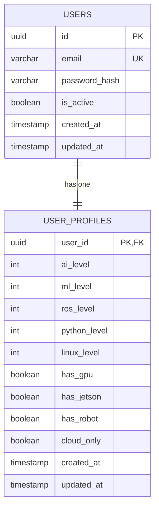
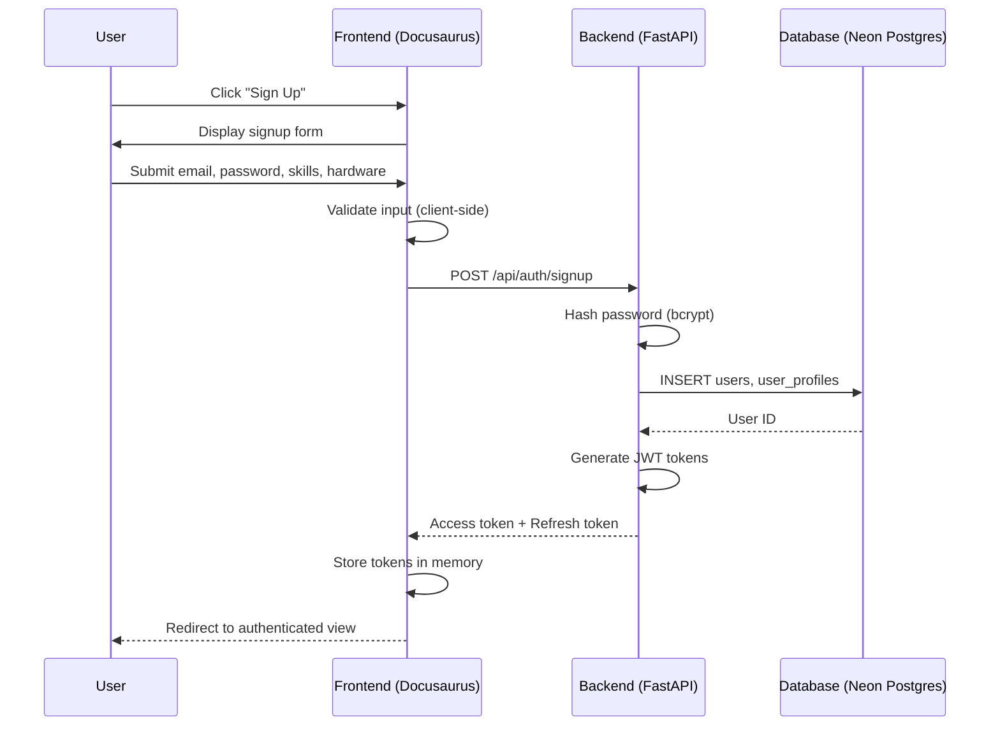
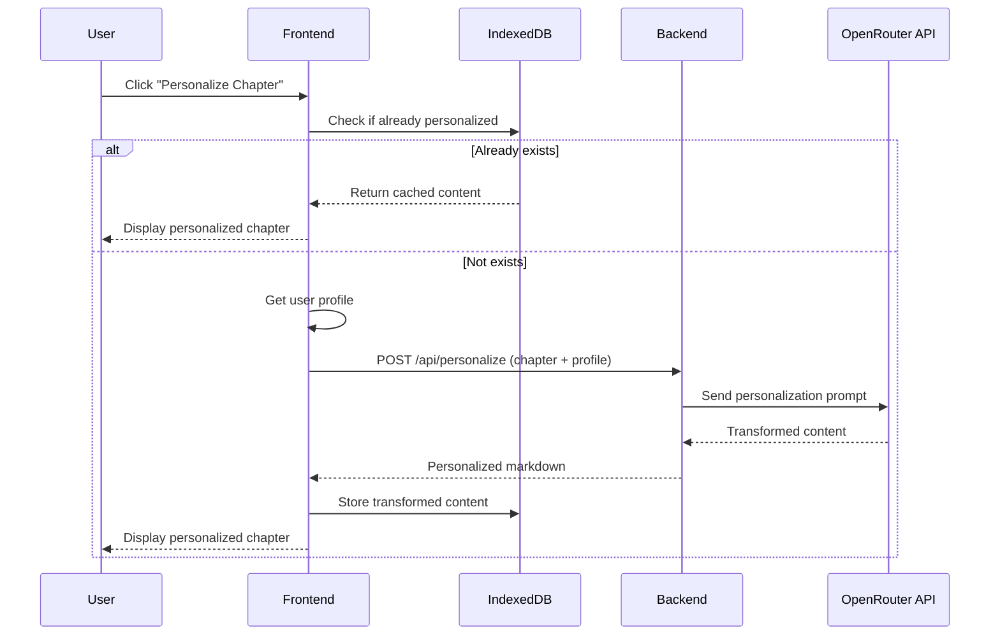
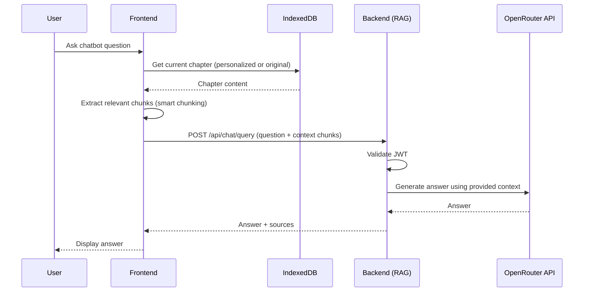

# Data Model: Authentication, Personalization, and Translation Integration

**Date**: 2025-12-17
**Feature**: 003-auth-personalization-translation
**Status**: Phase 1 - Design

## Overview

This document defines the complete data model for the authentication, personalization, and translation feature. It includes database schema (persistent storage), session storage schema (browser-side), and data flow diagrams.

---

## 1. Database Schema (Neon Serverless Postgres)

### 1.1 Users Table

**Purpose**: Store authentication credentials for registered users.

```sql
CREATE TABLE users (
    -- Primary Key
    id UUID PRIMARY KEY DEFAULT gen_random_uuid(),

    -- Authentication Credentials
    email VARCHAR(255) UNIQUE NOT NULL,
    password_hash VARCHAR(255) NOT NULL,  -- bcrypt hashed, cost factor 12

    -- Account Status
    is_active BOOLEAN DEFAULT TRUE NOT NULL,

    -- Audit Fields
    created_at TIMESTAMP WITH TIME ZONE DEFAULT NOW() NOT NULL,
    updated_at TIMESTAMP WITH TIME ZONE DEFAULT NOW() NOT NULL,

    -- Constraints
    CONSTRAINT email_format CHECK (email ~* '^[A-Za-z0-9._%+-]+@[A-Za-z0-9.-]+\.[A-Z|a-z]{2,}$')
);

-- Indexes
CREATE INDEX idx_users_email ON users(email);
CREATE INDEX idx_users_is_active ON users(is_active);
```

**Fields**:

| Field | Type | Constraints | Description |
|-------|------|-------------|-------------|
| `id` | UUID | PRIMARY KEY, NOT NULL | Unique user identifier (prevents enumeration attacks) |
| `email` | VARCHAR(255) | UNIQUE, NOT NULL, CHECK (valid format) | User's email address (login identifier) |
| `password_hash` | VARCHAR(255) | NOT NULL | bcrypt hashed password (never store plaintext) |
| `is_active` | BOOLEAN | NOT NULL, DEFAULT TRUE | Account status (allow account deactivation) |
| `created_at` | TIMESTAMP WITH TIME ZONE | NOT NULL, DEFAULT NOW() | Account creation timestamp |
| `updated_at` | TIMESTAMP WITH TIME ZONE | NOT NULL, DEFAULT NOW() | Last modification timestamp |

**Validation Rules** (enforced by FR-001, FR-004, FR-005):
- Email: Must be unique, valid email format
- Password: Minimum 8 characters, at least one uppercase, one lowercase, one number (validated in application, hashed before storage)
- is_active: Defaults to true; can be set to false for soft deletion

---

### 1.2 User Profiles Table

**Purpose**: Store user learning context for personalization logic.

```sql
CREATE TABLE user_profiles (
    -- Foreign Key (One-to-One with users)
    user_id UUID PRIMARY KEY REFERENCES users(id) ON DELETE CASCADE,

    -- Mandatory Skill Levels (1-5 scale)
    ai_level INTEGER NOT NULL CHECK (ai_level >= 1 AND ai_level <= 5),
    ml_level INTEGER NOT NULL CHECK (ml_level >= 1 AND ml_level <= 5),
    ros_level INTEGER NOT NULL CHECK (ros_level >= 1 AND ros_level <= 5),
    python_level INTEGER NOT NULL CHECK (python_level >= 1 AND python_level <= 5),
    linux_level INTEGER NOT NULL CHECK (linux_level >= 1 AND linux_level <= 5),

    -- Optional Hardware Access (Multi-Select)
    has_gpu BOOLEAN DEFAULT FALSE NOT NULL,
    has_jetson BOOLEAN DEFAULT FALSE NOT NULL,
    has_robot BOOLEAN DEFAULT FALSE NOT NULL,
    cloud_only BOOLEAN GENERATED ALWAYS AS (NOT has_gpu AND NOT has_jetson AND NOT has_robot) STORED,

    -- Audit Fields
    created_at TIMESTAMP WITH TIME ZONE DEFAULT NOW() NOT NULL,
    updated_at TIMESTAMP WITH TIME ZONE DEFAULT NOW() NOT NULL
);

-- Indexes
CREATE INDEX idx_user_profiles_user_id ON user_profiles(user_id);
CREATE INDEX idx_user_profiles_skill_levels ON user_profiles(ai_level, ml_level, ros_level, python_level, linux_level);
```

**Fields**:

| Field | Type | Constraints | Description |
|-------|------|-------------|-------------|
| `user_id` | UUID | PRIMARY KEY, FOREIGN KEY (users.id), ON DELETE CASCADE | References users table (one-to-one relationship) |
| `ai_level` | INTEGER | NOT NULL, CHECK (1-5) | AI skill level (1=Beginner, 5=Master) |
| `ml_level` | INTEGER | NOT NULL, CHECK (1-5) | ML skill level |
| `ros_level` | INTEGER | NOT NULL, CHECK (1-5) | ROS skill level |
| `python_level` | INTEGER | NOT NULL, CHECK (1-5) | Python skill level |
| `linux_level` | INTEGER | NOT NULL, CHECK (1-5) | Linux skill level |
| `has_gpu` | BOOLEAN | NOT NULL, DEFAULT FALSE | User has access to GPU hardware |
| `has_jetson` | BOOLEAN | NOT NULL, DEFAULT FALSE | User has access to NVIDIA Jetson device |
| `has_robot` | BOOLEAN | NOT NULL, DEFAULT FALSE | User has access to physical robot |
| `cloud_only` | BOOLEAN | GENERATED (computed) | True if no hardware access selected (computed column) |
| `created_at` | TIMESTAMP WITH TIME ZONE | NOT NULL, DEFAULT NOW() | Profile creation timestamp |
| `updated_at` | TIMESTAMP WITH TIME ZONE | NOT NULL, DEFAULT NOW() | Last modification timestamp |

**Validation Rules** (enforced by Clarification Q1):
- All 5 skill levels are mandatory (NOT NULL)
- Hardware access flags are optional (can all be FALSE)
- If all hardware flags are FALSE, `cloud_only` is automatically TRUE (computed column)

**Skill Level Scale** (application-level interpretation):
1. **Beginner**: Little to no experience
2. **Novice**: Some exposure, can follow tutorials
3. **Intermediate**: Comfortable with basics, can solve common problems
4. **Advanced**: Deep understanding, can design systems
5. **Expert/Master**: Industry-level expertise, can teach others

---

### 1.3 Entity Relationships



**Relationship Rules**:
- One User has exactly one UserProfile
- UserProfile cannot exist without a User (enforced by ON DELETE CASCADE)
- UserProfile is created immediately after successful User signup

---

## 2. Session Storage Schema (Browser IndexedDB)

### 2.1 Transformed Content Store

**Purpose**: Store personalized or translated chapter content in the browser session.

**IndexedDB Object Store Schema**:

```typescript
interface TransformedContentStore {
  // Composite Key
  key: string; // Format: "${userId}:${chapterId}:${transformationType}"

  // Metadata
  userId: string;
  chapterId: string;
  transformationType: "personalization" | "translation";

  // Content
  originalContent: string; // Original chapter markdown
  transformedContent: string; // Personalized or translated markdown

  // Transformation Context (for debugging/auditing)
  transformationMetadata: {
    // Profile snapshot at time of transformation
    profileSnapshot: {
      ai_level: number;
      ml_level: number;
      ros_level: number;
      python_level: number;
      linux_level: number;
      has_gpu: boolean;
      has_jetson: boolean;
      has_robot: boolean;
    };

    // LLM API details
    llmModel: string; // e.g., "meta-llama/llama-3.3-70b-instruct"
    requestTimestamp: string; // ISO 8601
    responseTimestamp: string; // ISO 8601
    tokenUsage: {
      inputTokens: number;
      outputTokens: number;
    };
  };

  // Timestamps
  createdAt: string; // ISO 8601
  expiresAt: string; // Session expiry (browser close or logout)
}
```

**Indexes**:
- Primary key: `key` (composite: userId:chapterId:transformationType)
- Secondary index: `userId` (for retrieving all transformations by user)
- Secondary index: `chapterId` (for retrieving all transformations for a chapter)

**Lifecycle**:
- Created: When user clicks "Personalize Chapter" or "Translate to Urdu"
- Read: When user navigates back to a previously transformed chapter
- Deleted: On user logout or browser close (session expiry)

**Storage Limits**:
- IndexedDB typically allows 50MB+ per origin
- Estimate: ~500KB per transformed chapter (5000 words * 100 bytes/word)
- Capacity: ~100 chapters per user session (well within limits)

---

## 3. API Request/Response Models

### 3.1 Authentication Models

#### Signup Request

```typescript
interface SignupRequest {
  // Credentials (mandatory)
  email: string; // Email format validation
  password: string; // Min 8 chars, 1 upper, 1 lower, 1 number

  // Skill Levels (mandatory, 1-5)
  skillLevels: {
    ai: number;
    ml: number;
    ros: number;
    python: number;
    linux: number;
  };

  // Hardware Access (optional, multi-select)
  hardwareAccess: {
    gpu: boolean;
    jetson: boolean;
    robot: boolean;
  };
}
```

#### Signup Response

```typescript
interface SignupResponse {
  success: boolean;
  data: {
    user: {
      id: string; // UUID
      email: string;
      createdAt: string; // ISO 8601
    };
    tokens: {
      accessToken: string; // JWT, 15-minute expiry
      refreshToken: string; // JWT, 7-day expiry
    };
    profile: UserProfile;
  };
}
```

#### Signin Request

```typescript
interface SigninRequest {
  email: string;
  password: string;
}
```

#### Signin Response

```typescript
interface SigninResponse {
  success: boolean;
  data: {
    user: {
      id: string;
      email: string;
    };
    tokens: {
      accessToken: string;
      refreshToken: string;
    };
    profile: UserProfile;
  };
}
```

---

### 3.2 Personalization Models

#### Personalize Request

```typescript
interface PersonalizeRequest {
  chapterId: string; // e.g., "module-1-chapter-3"
  chapterContent: string; // Original markdown content
  userProfile: UserProfile; // User's skill levels and hardware
}
```

#### Personalize Response

```typescript
interface PersonalizeResponse {
  success: boolean;
  data: {
    chapterId: string;
    personalizedContent: string; // Transformed markdown
    metadata: {
      llmModel: string;
      tokenUsage: {
        inputTokens: number;
        outputTokens: number;
      };
      processingTimeMs: number;
    };
  };
}
```

---

### 3.3 Translation Models

#### Translate Request

```typescript
interface TranslateRequest {
  chapterId: string;
  chapterContent: string; // Original English markdown
  targetLanguage: "ur"; // Urdu (ISO 639-1 code)
  mode: "focus"; // Focus Mode: technical faithfulness
}
```

#### Translate Response

```typescript
interface TranslateResponse {
  success: boolean;
  data: {
    chapterId: string;
    translatedContent: string; // Urdu markdown
    metadata: {
      llmModel: string;
      tokenUsage: {
        inputTokens: number;
        outputTokens: number;
      };
      processingTimeMs: number;
      preservedTerms: string[]; // Technical terms preserved in English
    };
  };
}
```

---

### 3.4 RAG Chatbot Models (Modified)

#### Chat Query Request (Modified to Accept Context)

```typescript
interface ChatQueryRequest {
  question: string; // User's question
  contextChunks: string[]; // Personalized or translated content chunks
  userId: string; // For logging
  answerLength: "brief" | "medium" | "detailed";
  answerStyle: "technical" | "beginner-friendly";
}
```

#### Chat Query Response (Unchanged)

```typescript
interface ChatQueryResponse {
  success: boolean;
  data: {
    answer: string;
    sources: Array<{
      chapterId: string;
      snippet: string;
      relevanceScore: number;
    }>;
    confidence: number; // 0.0-1.0
    metadata: {
      userId: string;
      llmModel: string;
      tokenUsage: {
        inputTokens: number;
        outputTokens: number;
      };
    };
  };
}
```

---

## 4. Data Flow Diagrams

### 4.1 Authentication Flow



### 4.2 Personalization Flow



### 4.3 RAG Chatbot with Transformed Content



---

## 5. Validation Rules Summary

### Backend Validation (FastAPI + Pydantic)

```python
from pydantic import BaseModel, EmailStr, Field, validator

class SignupRequestModel(BaseModel):
    email: EmailStr  # Validates email format
    password: str = Field(..., min_length=8)

    # Skill levels
    ai_level: int = Field(..., ge=1, le=5)
    ml_level: int = Field(..., ge=1, le=5)
    ros_level: int = Field(..., ge=1, le=5)
    python_level: int = Field(..., ge=1, le=5)
    linux_level: int = Field(..., ge=1, le=5)

    # Hardware access
    has_gpu: bool = False
    has_jetson: bool = False
    has_robot: bool = False

    @validator('password')
    def validate_password_complexity(cls, v):
        if not any(c.isupper() for c in v):
            raise ValueError('Password must contain at least one uppercase letter')
        if not any(c.islower() for c in v):
            raise ValueError('Password must contain at least one lowercase letter')
        if not any(c.isdigit() for c in v):
            raise ValueError('Password must contain at least one digit')
        return v
```

### Frontend Validation (TypeScript + Zod)

```typescript
import { z } from 'zod';

const signupSchema = z.object({
  email: z.string().email(),
  password: z.string()
    .min(8, "Password must be at least 8 characters")
    .regex(/[A-Z]/, "Password must contain at least one uppercase letter")
    .regex(/[a-z]/, "Password must contain at least one lowercase letter")
    .regex(/[0-9]/, "Password must contain at least one digit"),

  skillLevels: z.object({
    ai: z.number().int().min(1).max(5),
    ml: z.number().int().min(1).max(5),
    ros: z.number().int().min(1).max(5),
    python: z.number().int().min(1).max(5),
    linux: z.number().int().min(1).max(5),
  }),

  hardwareAccess: z.object({
    gpu: z.boolean(),
    jetson: z.boolean(),
    robot: z.boolean(),
  }),
});
```

---

## 6. Database Migration Strategy

### Initial Migration (Alembic)

**File**: `backend/src/db/migrations/versions/YYYYMMDD_HHMM_add_user_auth_tables.py`

```python
"""Add user authentication and profile tables

Revision ID: XXXXXX
Revises: YYYYYY
Create Date: 2025-12-17

"""
from alembic import op
import sqlalchemy as sa
from sqlalchemy.dialects import postgresql

# revision identifiers
revision = 'XXXXXX'
down_revision = 'YYYYYY'  # Previous migration
branch_labels = None
depends_on = None


def upgrade():
    # Create users table
    op.create_table(
        'users',
        sa.Column('id', postgresql.UUID(as_uuid=True), primary_key=True, server_default=sa.text('gen_random_uuid()')),
        sa.Column('email', sa.String(255), unique=True, nullable=False),
        sa.Column('password_hash', sa.String(255), nullable=False),
        sa.Column('is_active', sa.Boolean(), nullable=False, server_default=sa.text('true')),
        sa.Column('created_at', sa.TIMESTAMP(timezone=True), nullable=False, server_default=sa.text('NOW()')),
        sa.Column('updated_at', sa.TIMESTAMP(timezone=True), nullable=False, server_default=sa.text('NOW()')),
        sa.CheckConstraint("email ~* '^[A-Za-z0-9._%+-]+@[A-Za-z0-9.-]+\.[A-Z|a-z]{2,}$'", name='email_format')
    )

    # Create indexes on users
    op.create_index('idx_users_email', 'users', ['email'])
    op.create_index('idx_users_is_active', 'users', ['is_active'])

    # Create user_profiles table
    op.create_table(
        'user_profiles',
        sa.Column('user_id', postgresql.UUID(as_uuid=True), sa.ForeignKey('users.id', ondelete='CASCADE'), primary_key=True),
        sa.Column('ai_level', sa.Integer(), nullable=False),
        sa.Column('ml_level', sa.Integer(), nullable=False),
        sa.Column('ros_level', sa.Integer(), nullable=False),
        sa.Column('python_level', sa.Integer(), nullable=False),
        sa.Column('linux_level', sa.Integer(), nullable=False),
        sa.Column('has_gpu', sa.Boolean(), nullable=False, server_default=sa.text('false')),
        sa.Column('has_jetson', sa.Boolean(), nullable=False, server_default=sa.text('false')),
        sa.Column('has_robot', sa.Boolean(), nullable=False, server_default=sa.text('false')),
        sa.Column('cloud_only', sa.Boolean(), sa.Computed('NOT has_gpu AND NOT has_jetson AND NOT has_robot'), stored=True),
        sa.Column('created_at', sa.TIMESTAMP(timezone=True), nullable=False, server_default=sa.text('NOW()')),
        sa.Column('updated_at', sa.TIMESTAMP(timezone=True), nullable=False, server_default=sa.text('NOW()')),
        sa.CheckConstraint('ai_level >= 1 AND ai_level <= 5', name='ai_level_range'),
        sa.CheckConstraint('ml_level >= 1 AND ml_level <= 5', name='ml_level_range'),
        sa.CheckConstraint('ros_level >= 1 AND ros_level <= 5', name='ros_level_range'),
        sa.CheckConstraint('python_level >= 1 AND python_level <= 5', name='python_level_range'),
        sa.CheckConstraint('linux_level >= 1 AND linux_level <= 5', name='linux_level_range')
    )

    # Create indexes on user_profiles
    op.create_index('idx_user_profiles_user_id', 'user_profiles', ['user_id'])
    op.create_index('idx_user_profiles_skill_levels', 'user_profiles', ['ai_level', 'ml_level', 'ros_level', 'python_level', 'linux_level'])


def downgrade():
    op.drop_table('user_profiles')
    op.drop_table('users')
```

---

## Data Model Status: ✅ Complete

All entities, relationships, validation rules, and data flows documented. Proceed to **API Contracts Generation**.
