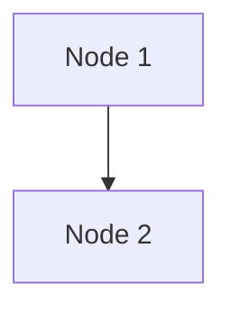

# Chapter 1 Diagrams - ROS 2 Architecture

This directory contains Mermaid diagrams for Chapter 1: ROS 2 Architecture & Core Concepts.

## Diagrams

### 1. `ros2-architecture.mermaid` - Complete ROS 2 System Architecture

**Purpose:** Illustrate the layered architecture of ROS 2 from application nodes down to network transport.

**Layers Shown:**
- **Application Layer**: Example nodes (Camera Driver, Image Processor, Object Detector, Motion Planner)
- **ROS 2 Graph Layer**: Topics, Services, Actions with message types
- **DDS Middleware Layer**: DDS Publishers/Subscribers, Service/Action Servers/Clients
- **Transport Layer**: UDP Multicast (Discovery), TCP/UDP (Data), Shared Memory (Local)

**Learning Objectives:**
- Understand separation of concerns across layers
- Visualize how nodes communicate through topics, services, and actions
- See how DDS middleware abstracts network complexity

**Usage in Documentation:**
```mdx
import Mermaid from '@theme/Mermaid';

<Mermaid chart={`
  ${require('!!raw-loader!./ros2-architecture.mermaid').default}
`} />
```

---

### 2. `dds-layer.mermaid` - DDS Discovery and Data Transfer

**Purpose:** Deep dive into DDS layer operations, showing discovery protocol and data transfer mechanisms.

**Concepts Illustrated:**
- **Discovery Service (SPDP/SEDP)**: How nodes find each other
- **Endpoint Matching**: Publisher-Subscriber pairing based on QoS compatibility
- **Transport Selection**: Shared memory for local communication, UDP/TCP for remote
- **Zero-Copy Optimization**: Shared memory eliminates serialization overhead

**Learning Objectives:**
- Understand DDS discovery protocol (Simple Participant Discovery Protocol / Simple Endpoint Discovery Protocol)
- See how ROS 2 optimizes for local vs. remote communication
- Learn the role of QoS in endpoint matching

---

### 3. `qos-policies.mermaid` - QoS Policy Patterns

**Purpose:** Compare QoS configurations for common ROS 2 use cases.

**Patterns Shown:**
1. **Sensor Data** (`/camera/image_raw`):
   - Best Effort reliability (tolerate loss)
   - Volatile durability (no persistence)
   - Keep Last 1 history (only latest frame)
   - Short deadline and lifespan

2. **Command Data** (`/cmd_vel`):
   - Reliable delivery (zero loss)
   - Volatile durability
   - Keep Last 5 history (buffer recent commands)
   - Strict deadline

3. **Configuration Data** (`/robot_description`):
   - Reliable delivery
   - Transient Local durability (late-joiners receive data)
   - Keep Last 1 history
   - Infinite lifespan

**Learning Objectives:**
- Map QoS policies to real-world communication patterns
- Understand trade-offs (performance vs. reliability)
- Learn when to use each QoS profile

---

## Rendering in Docusaurus

Docusaurus 3.x supports Mermaid diagrams natively. To include these diagrams:

### Method 1: Direct Embedding (Recommended)

```mdx

```

### Method 2: Import from File

```mdx
import Mermaid from '@theme/Mermaid';

<Mermaid chart={require('!!raw-loader!@site/static/img/module-1-ros2/chapter-1/ros2-architecture.mermaid').default} />
```

### Method 3: Use MDX Import

```mdx
import ROS2Arch from '@site/static/img/module-1-ros2/chapter-1/ros2-architecture.mermaid';

<Mermaid chart={ROS2Arch} />
```

## Accessibility Considerations

All diagrams should have:
- Clear color contrast (WCAG AA compliant)
- Text labels (not color-only encoding)
- Alternative text descriptions in MDX

Example:
```mdx
<figure>
  <Mermaid chart={ros2Architecture} />
  <figcaption>
    Figure 1: ROS 2 layered architecture showing application nodes,
    graph layer (topics/services/actions), DDS middleware, and transport layer.
  </figcaption>
</figure>
```

## Further Customization

To customize Mermaid theme in `docusaurus.config.js`:

```javascript
module.exports = {
  markdown: {
    mermaid: true,
  },
  themes: ['@docusaurus/theme-mermaid'],
  themeConfig: {
    mermaid: {
      theme: {light: 'neutral', dark: 'dark'},
      options: {
        maxTextSize: 50000,
      },
    },
  },
};
```

## References

- [Mermaid Documentation](https://mermaid.js.org/)
- [Docusaurus Diagrams Guide](https://docusaurus.io/docs/markdown-features/diagrams)
- [DDS Specification](https://www.omg.org/spec/DDS/)
